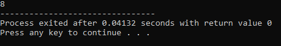
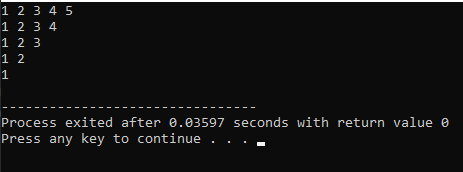
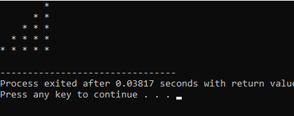
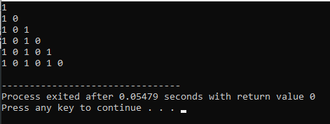
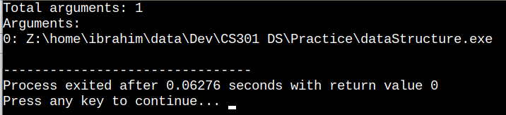
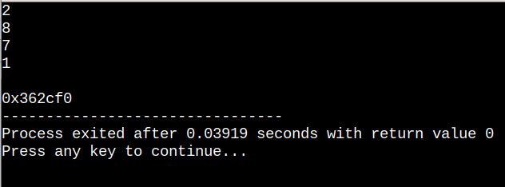
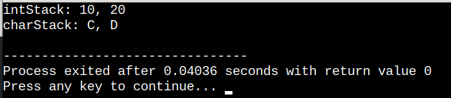
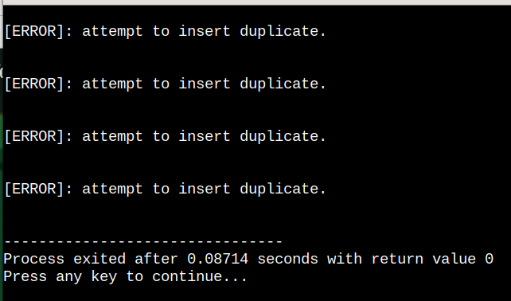

# !! Warm-up Questions

## Problem Statement #01

### Find second largest number from array

```C++
//solution
#include <iostream>
#include <cmath>
using namespace std;

int secondLargest(int arr[], int size){
	if(size < 2){
		cerr << "\n[ERROR]: To find second largest, array must have minimun 2 elemnts.\n";
		return -1;
	}else{
		int firstLargest = -INFINITY;
		int secondLargest = -INFINITY;
		 
		for(int i=0; i<size; i++){
			if(arr[i] > firstLargest){
				secondLargest = firstLargest;
				firstLargest = arr[i];
			}else if(arr[i] > secondLargest && arr[i] != firstLargest){
				secondLargest = arr[i];
			}
		}
		return secondLargest;
	}
}

int main(){
	const int size = 10;
	int array[size] = {-4,-9,0,2,8,7,10,2,0,-30};
	
	int result;
	result = secondLargest(array, size);
	
	cout << result;
		
	return 0;
}
```

>

## Problem Statement #02

### Print 1 till 5 per line in order of decreasing 1 digit from end on each line

```C++
//solution

//My First Solution
#include <iostream>
#include <cmath>
using namespace std;
int main(){
	int n = 5;
	
	for(int i = 0; i<5; i++){
		for(int j=n-i; j>0; j--){
			cout << n-j-i+1 << " ";
		}
		cout << endl;
	}
		
	return 0;
}


//Improved logic
// #include <iostream>
// #include <cmath>
// using namespace std;
// int main(){
// 	int n = 5;
	
// 	for(int i = 0; i<5; i++){
// 		for(int j=0; j<n-i; j++){
// 			cout << j+1 << " ";
// 		}
// 		cout << endl;
// 	}
		
// 	return 0;
// }
```

>

## Problem Statement #03

### Print lower-diagonal stars pattern

```C++
//solution

//My Solution
#include <iostream>
#include <cmath>
using namespace std;
int main(){
	int n = 5;
	
	for(int i=0; i<n; i++){
		for(int j=0; j<n; j++){
			if(j < (n-(i+1))){
				cout << "  ";
			}else{
				cout << "* ";
			}
		}
		cout << endl;
	}
		
	return 0;
}


//Improved solution
// #include <iostream>
// #include <cmath>
// using namespace std;
// int main(){
// 	int n = 5;
	
// 	for(int i=0; i<n; i++){
// 		for(int j=0; j<n-(i+1); j++){
// 			cout << "  ";
// 		}
// 		for(int k=0; k<(i+1); k++){
// 			cout << "* ";
// 		}
// 		cout << endl;
// 	}
		
// 	return 0;
// }
```

>

## Problem Statement #04

### Print lower-left binary diagonal

```C++
//solution
#include <iostream>
#include <cmath>
using namespace std;
int main(){
	int n = 6;
	
	for(int i=0; i<n; i++){
		int toggle = 1;
		for(int j=0; j<i+1; j++){
			cout << toggle << " ";
			toggle == 0 ? toggle = 1 : toggle = 0;
		}
		cout << endl;
	}
		
	return 0;
}
```

>
## Problem Statement #05

### Cont digits in a number

```C++
//solution
#include <iostream>
#include <cmath>
using namespace std;

int main() {
	int count = 0;
	long long num = 1466456;
	
	while(num){
		num = floor(num/10);
		count++;
	}
    
    cout << count;
    
    return 0;
}
```

---
---


# !! General Purpose

## Problem Statement #0.1

### Describing the use of (int argc, char** argv)

```C++
//solution
#include <iostream>
using namespace std;

/*
At Execution from command line:
argc = How many words were typed.
argv = What those words were.*/
int main(int argc, char** argv) {
    cout << "Total arguments: " << argc << endl;
    cout << "Arguments:\n";
    for (int i = 0; i < argc; i++) {
        cout << i << ": " << argv[i] << endl;
    }
    return 0;
}
```

>

---
---

# !! LIST 

## Problem Statement #01

### LIST using Linked Memory / Singly linked list

```C++
//solution
#include <iostream>
using namespace std;

class Node{
	private:
		int object;
		Node *nextNode;

	public:
		int get(){return object;};
		void set(int object){
			this->object = object;//we used this->object to differ data member object from parameter object
		};
		Node* getNext(){
			 return nextNode;
		};
		void setNext(Node *nextNode){
			this->nextNode = nextNode;
		}
};

class List{
	private:
		Node *headNode;
		Node *currentNode;
		Node *lastCurrentNode;
		int size;

	public:
		//Constructor
		List(){
			headNode = new Node();
			headNode->setNext(NULL);
			currentNode = NULL;
			size = 0;
		};

		Node* getCurrent(){
			return currentNode;
		}

		void add(int addObject){
			Node *newNode = new Node();
			newNode->set(addObject);
			//if list is not empty
			if(currentNode != NULL){
				//newNode's next will now point to what current's next was pointing to
				newNode->setNext(currentNode->getNext());
				//current's next will now point to newNode
				currentNode->setNext(newNode);
				//store what current node was at, last time
				lastCurrentNode = currentNode; //member to member copy
				//current will now point to new node
				currentNode = newNode;
			}else{//if list was empty
				newNode->setNext(NULL);
				headNode->setNext(newNode);
				lastCurrentNode = headNode;
				currentNode = newNode;
			}
			size++;
		};

		int get(){
			if(currentNode != NULL){
				return currentNode->get();
			}
		};

  		bool next() {
		    if(currentNode == NULL || size == 0 || currentNode->getNext() == NULL){
		    	return false;
			}
			
			lastCurrentNode = currentNode;
			currentNode = currentNode->getNext();
			
//   //Redundant code
//		    if (currentNode->getNext() == NULL || size == 0) //it should not be "currentNode == NULL", bcz currentNode == NULL which checks for if list is empty/not
//		        return false;
//		    else
		        return true;
		};

		//position current before the first list element
		void start(){
			lastCurrentNode = currentNode;
			if(headNode->getNext() != NULL){
				currentNode = headNode->getNext();
			}else{
				currentNode = headNode;
			}
			
		};
		
		void remove(){
			if(currentNode != NULL && currentNode != headNode){
				lastCurrentNode->setNext(currentNode->getNext());
				delete currentNode;//Free the old memory to store new address
				currentNode = lastCurrentNode->getNext();
				size--;
			}
		};
		
		int length(){
			return size;
		};
};

int main(){

	List list;

	list.add(2);
	list.add(6);
	list.add(8);
	list.add(7);
	list.add(1);
	list.add(9);

	list.remove();

	list.start();

	list.next();
	
	list.remove();

	list.start();

	do{
		cout << list.get() <<endl;
	}while(list.next());

	
	list.start();

	Node *temp = list.getCurrent();

	cout << "\n"<< temp->getNext();

	return 0;
}
```

>

## Prooblem Statement #02

### Implementing Josephus Problem

```C++
//Solution - NON COMPILEABLE
#include "Clist.cpp"

void main(int argc, char *argv[]) {
    Clist list;
    int N = 10, M = 3;
    
    for (int i = 1; i <= N; i++) list.add(i);

    list.start();
    while (list.length() > 1) {
        for (int i = 1; i <= M; i++) list.next();
        cout << "remove: " << list.get() << endl;
        list.remove();
    }
    cout << "leader is: " << list.get() << endl;
}
```

>

## Prooblem Statement #03 - cont. Need updation

### Implementation of List using Array

```C++
//Solution
#include <iostream>
#include <string>
using namespace std;

//implementing List using an array
template <typename T>
class List{
	private:
		static const int CAPACITY = 5;
		T arr[CAPACITY];
		int current;
		int size;
		string listName;
		
	public:
		List(string listName);
		
		void copy(List list);
		void clear();
		void insert(T x, int index);
		T remove(T x);
		T removeAt(int index);
		void update(T x, int index);
		bool find(T x);
		T getCurrent();
		int length();
		void display();
		
		void start();
		void tail();
		void next();
		void back();
		
};

template <typename T>
List<T>::List(string listName) : arr{}{
	this->listName = listName;
	current = 0;
	size = 0;
}

template <typename T>
int List<T>::length(){
	return size;
}

template <typename T>
void List<T>::display(){
	if(size != 0){
		cout << "..............................\n";
		for (int i=0; i<CAPACITY; i++){
			cout << i+1 << ". " << arr[i] <<endl;
		}
		cout << "..............................\n";
	}else{
		cout << "\n[ALERT]: Cannot Display, Your " << listName << " is empty.\n";
	}
}

template <typename T>
T List<T>::getCurrent(){
	return arr[current];
}

template <typename T>
bool List<T>::find(T x){
	if(size != 0){
		for(int i = 0; i<size; i++){
			if(arr[i] == x ){
				current = i; 
				return true;
			}
		}
		return false;
	}else{
		cout << "\n[ALERT]: Cannot find, Your " << listName << " is empty.\n";
		return false;
	}
}

template <typename T>
void List<T>::update(T x, int index){
	if(size != 0 && index >= 0 && index < size ){
		arr[index] = x;
		current = index;
	}else{
		cout << "\n[ALERT]: Cannot update. Invalid index, or " << listName << " is empty.\n";
	}
}

template <typename T>
T List<T>::removeAt(int index){
	if(size != 0 && index >= 0 && index < size ){
		T removed = arr[index];
		for(int i=index; i<size; i++){
			
			arr[i] = arr[i+1];
		}
		size--;
		return removed;
	}else{
		cout << "\n[ALERT]: Cannot remove. Invalid index, or " << listName << " is empty.\n";
		return 0;
	}
}

template <typename T>
T List<T>::remove(T x){
	if(find(x)){
		removeAt(current);
	}
}

template <typename T>
void List<T>::insert(T x, int index){
	if(size != CAPACITY && index >= 0 && index < CAPACITY && arr[index] == T{}){
		if(index == CAPACITY-1){
			arr[index] = x;
			size++;
		}else{
			for(int i=size; i>=index; i--){
				arr[i+1] = arr[i];
			}
			arr[index] = x;
			size++;
		}
	}else{
		cout << "\n[ALERT]: Cannot insert. Invalid index, or this place already contains some value or " << listName << " is full.\n";
	}
}

template <typename T>
void List<T>::clear(){
	for(int i=0; i<CAPACITY; i++){
		arr[i] = 0;
	}
	size = 0;
};

int main(){

	List<int> list1("TestList");	
	

	cout << "Length of list is: " << list1.length() << endl;
	
	list1.display();
	
	cout << "current item is: " << list1.getCurrent() << endl;
	
	if(list1.find(15)){
		cout << "15 found" << endl;
	}else{
		cout << "15 not found" << endl;
	}
	
	list1.update(12, 0);
	
	int rem = list1.removeAt(3);
	if(rem) cout << "Removed value at 3: " << rem<< endl;
	
	list1.remove(3);
	
	list1.insert(6, 4);
	
	list1.display();
	
	list1.clear();
	
	list1.display();
	
	return 0;
}
```

>

---
---

# !! Stack

## Prooblem Statement #01

### Stack implementation using linked list

```C++
//Solution
#include <iostream>
#include "Node.cpp"//copy node class code from above
using namespace std;

class Stack{
	private:
		Node *head;
		
	public:
		int pop(){
			if(head != NULL){
				int x;
				if(head->getNext() != NULL){
					x = head->get();//store the value in x
					Node *p = head;//store the node what head is pointing at in p;
					head = head->getNext();//move head to next node;
					delete p;//delete what head was pointing at before;
				}else{
	   				x = head->get();//store the value in x
					Node *p = head;//store the node what head is pointing at in p;
					head = NULL;//now head is pointing at NULL
					delete p;//delete what head was pointing at before;
				}
				return x;
			}else{
				cout << "\n[ERROR]: Stack is empty.\n" <<endl;
			}
//			if(head->getNext() != NULL){
//   				int x = head->get();//store the value in x
//				Node *p = head;//store the node what head is pointing at in p;
//				head = head->getNext();//move head to next node;
//				delete p;//delete what head was pointing at before;
//			}else-if(head != NULL){
//				
//				
//			}
//			return x;
		}
		
		void push(int x){
			if(head == NULL){//if this is the first node, it's next will be null
				Node *newNode = new Node;
				newNode->set(x);
				newNode->setNext(NULL);
				head = newNode;
			}else{
				Node *newNode = new Node;
				newNode->set(x);
				newNode->setNext(head);
				head = newNode;
			}
		}
		
		int top(){
			return head->get();
		}
		
		bool isEmpty(){
			return (head == NULL);
		}
};

int main(){
	
	Stack S;
	
	S.pop();
	
	S.push(2);
	S.pop();
	
	
	return 0;
}
```

>

## Prooblem Statement #02

### Stack implementation using template class & dynamic array

```C++
//Solution

	```C++
		// Stack.h file
		template <class T>
		class Stack{
			private:
				int top;
				T *nodes;
			public:
				Stack();
				bool empty(void); //1=true, 0=false
				bool push(T &); //1=successful, 0=stack overflow
				T pop(void);
				T peek(void); //top()
				~Stack();
		};
	```

	```C++
		// Stack.cpp file
		#include <iostream>
		#include "Stack.h"
		using namespace std;

		#define MAXSTACKSIZE 50 //manifest constant

		template <class T>
		Stack<T>::Stack(){
			top = -1; //top is initially refering to an empty stack
			nodes = new T[MAXSTACKSIZE];
		}

		template <class T>
		Stack<T>::~Stack(){
			delete[] nodes;
		}

		template <class T>
		bool Stack<T>::empty(void){
			if(top < 0) return true;
			return false;
		}

		template <class T>
		bool Stack<T>::push(T &x){
			if(top < MAXSTACKSIZE){
				nodes[++top] = x;
				return true;
			}
			cout << "\n[ERROR]: Stack overflow in push.\n"<<endl;
			return false;
		}

		template <class T>
		T Stack<T>::pop(){
			T x;
			if(!empty()){
				x = nodes[top--];
				return x;
			}
			cout << "\n[ERROR]: Stack underflow in pop.\n"<<endl;
			return x;
		}
	```

	```C++
		// main.cpp file
		#include "Stack.cpp"
		//using namespace std;

		int main(int argc, char *argv[]){
			Stack<int> intStack;
			Stack<char> charStack;
			
			int x=10, y=20;
			char c='C', d='D';
			
			intStack.push(x);
			intStack.push(y);
			cout << "intStack: " <<intStack.pop() << ", "
				<< intStack.pop() <<endl;
			
			charStack.push(c);
			charStack.push(d);
			cout << "charStack: " <<charStack.pop() << ", "
				<< charStack.pop() <<endl;

			return 0;
		}
	```

```

>

---
---

# !! Queue

## Prooblem Statement #01

### Bank-Customer simulation


```C++
//Solution - NON COMPILEABLE
#include <iostream>
#include <string>
#include <strstream>

#include "Customer.cpp"
#include "Queue.h"
#include "PriorityQueue.cpp"
#include "Event.cpp"

Queue q[4]; //teller queues
PriorityQueue pq; //eventList
int totalTime;
int count = 0;
int customerNo = 0;

void readNewCustomer(ifstream &data){
	int hour, min, duration;
	if(data >> hour >> min >> duration){
		customerNo++;
		Customer *c = new Customer(customerNo, hour*60+min, duration);
		c->setStatus(-1);//new arrival
		Event *e = new Event(c, hour*60+min);
		pq.insert(e);//insert the arrival event
	}else{
		data.close();//close the customer file
	}
}

void processArrival(ifstream &data, int customerNo, int arrTime, int duration, Event *event){
	int small, j=0;
	//find smallest teller queue;
	small = q[0].length();
	for(int i=0; i<4; i++){
		if(q[i].length() < small){
			small = q[i].length();
			j=i;
		}
	}
	
	//put arriving customer in smallest queue
	Customer *c = new Customer(customerNo, arrTime, duration);
	c->setStatus(j);
	//remember which queue the customer goes in
	q[j].enqueue(c);
	
	/*check if this is the only customer in queue. if so the
	customer must be marked for departure by placing him on the event queue.*/
	if(q[i].length() == 1){
		c->setDepartureTime(arrTime+duration);
		Event *e = new Event(c, arrTime+duration);
		pq.insert(e);
	}
	
	//get another customer from input
	readNewCustomer(data);
}

void processDeparture(int qindex, int departTime, Event *event){
	Customer *cinq = q[qindex].dequeue();
	
	int waitTime = departTime - cinq->getArrivalTime();
	totalTime += waitTime;
	count += 1;

	/*if there are any more customers on the queue, mark the
	next customer at the head of the queue for departure
	and place him on the eventList.*/
	if(q[qindex].length() > 0){
		cinq = q[qindex].front();
		int etime = departTime+cinq->getTransactionDuration();
		Event *e = new Event(cinq, etime);
		pq.insert(e);
	}
}

int main(int argc, char *argv[]){
	Customer *c;
	Event *nextEvent;
	
	//open customer arrival file
	ifstream data("customers.txt", ios::in);
	
	//initialize the  first arriving customer
	readNewCustomer(data);
	
	while(pq.length() > 0){
		nextEvent = pq.remove();
		c = nextEvent->getCustomer();
		if(c->getStatus() == -1){
			//arrival event
			int arrTime = nextEvent->getEventTime();
			int duration = c->getTransactionDuration();
			int customerNo = c->getCustomerNumber();
			processArrival(data, customerNo, arrTime, duration, nextEvent);
		}
		else{
			//departure event
			int qindex = c->getStatus();
			int departTime = nextEvent->getEventTime();
			processDeparture(qindex, departTime, nextEvent);
		}
	}
	
	//print the final avg wait time
	double avgWait = (totalTime*1.0)/count;
	
	cout << "Total time:    " << totalTime <<"\n"
		 << "Custome:       " << count <<"\n"
		 << "Average wait:  " << avgWait <<endl;
	
	return 0;
}
```

>

---
---

# !! Priority Queue

## Prooblem Statement #01

### Priority queue implementation for EVENT class

```C++
//Solution - NON COMPILEABLE
#include "Event.cpp"
#define PQMAX 30

class PriorityQueue{
	
	
	public:
		PriorityQueue():size(0), rear(-1) {};
		
		~PriorityQueue();
		
		bool full(void){
			return (size == PQMAX);
		};
		
		Event* remove(){
			if(size > 0){
				Event* e = nodes[0];
				for(int i=0; i<size-1; i++){
					nodes[i] = nodes[i+1];
				}
				size -= 1;
				rear -= 1;
				if(size == 0){
					rear = -1;
				}
				return e;
			}
			cout << "\n[ERROR]: remove = queue is empty.\n" <<endl;
			return (Event*)NULL; //return nullPtr
		};
		
		bool insert(Event* e){
			if( !full() ){
				rear += 1;
				nodes[rear] = e;
				size += 1;
				sortElements(); //in ascending order
				return true;
			}
			cout << "\n[ERROR]: insert queue is full.\n" << endl;
			return false;
		};
		
		int length(){
			return size;
		};
};
```

>

---
---

# !! Binary Tree

## Prooblem Statement #01

### Binary tree implementation

```C++
//Solution
	//TreeNode.cpp file
	#include <cstdlib>

	template <class Object>
	class TreeNode{
		private:
			Object *object;
			TreeNode *left;
			TreeNode *right;

		public:
			//constructors
			TreeNode(){
				this->object = NULL;
				this->left = this->right = NULL;
			}
			TreeNode(Object *object){
				this->object = object;
				this->left = this->right = NULL;
			}
			
			~TreeNode(){
				delete object;
				delete left;
				delete right;
			}

			Object* getInfo(){
				return this->object;
			}
			void setInfo(Object *object){
				this->object = object;
			}
			TreeNode* getLeft(){
				return this->left;
			}
			void setLeft(TreeNode *left){
				this->left = left;
			}
			TreeNode* getRight(){
				return this->right;
			}
			void setRight(TreeNode *right){
				this->right = right;
			}

			bool isLeaf(){
				return (this->left == NULL && this->right == NULL);
			}
	};

	//main file
	#include <iostream>
	#include <cstdlib>
	#include "TreeNode.cpp"

	using namespace std;

	void insert(TreeNode<int> *root, int *info){
		TreeNode<int> *node = new TreeNode<int>(info);
		
		TreeNode<int> *p, *q;
		p = q = root;
		while(*info != *(p->getInfo()) && q != NULL){
			p = q;
			
			if(*info < *(p->getInfo())){
				q = p->getLeft();
			}else{
				q = p->getRight();
			}
		}
		
		if(*info == *(p->getInfo())){
			cout << "\n[ERROR]: attempt to insert duplicate.\n" <<endl;
			delete node;
		}else if(*info < *(p->getInfo())){
			p->setLeft(node);
		}else{
			p->setRight(node);
		}
	}

	int main(int argc, char* argv[]){
		
		int x[] = {14, 15, 4, 5, 7, 18, 3, 5, 16, 4, 28, 17, 5, -1};
		
		TreeNode<int> *root = new TreeNode<int>();
		root->setInfo(&x[0]);
		for(int i=0; x[i]>0; i++){
			insert(root, &x[i]);
		}
		
		return 0;
	}
```

>

## Prooblem Statement #02

### BST Traversal methods Recursive versions

```C++
//Solution - NON COMPILEABLE
void preorder(TreeNode<int> *treeNode){
	if(treeNode != NULL){
		cout << *(treeNode->getInfo()) << " ";
		preorder(treeNode->getLeft());
		preorder(treeNode->getRight());
	}
}

void inorder(TreeNode<int> *treeNode){
	if(treeNode != NULL){
		inorder(treeNode->getLeft());
		cout << *(treeNode->getInfo()) << " ";
		inorder(treeNode->getRight());
	}
}

void postorder(TreeNode<int> *treeNode){
	if(treeNode != NULL){
		inorder(treeNode->getLeft());
		inorder(treeNode->getRight());
		cout << *(treeNode->getInfo()) << " ";
	}
}

cout << "preorder: " << preorder(root) <<endl;
cout << "inorder: " << inorder(root) <<endl;
cout << "postorder: " << preorder(root) <<endl;
```

>

## Prooblem Statement #02

### BST Traversal methods non-recursive versions

```C++
//Solution - NON COMPILEABLE
void inorder(TreeNode<int> *root){
	Stack<TreeNode<int>* > stack;
	TreeNode<int> *p;
	p = root;
	do{
		while(p != NULL){
			stack.push(p);
			p = p->getLeft();
		}
		//at this point, 'left' tree is empty
		
		if(!stack.empty()){
			p = stack.pop();
			cout << *(p->getInfo()) << " ";
			//go back & traverse right subtree
			p = p->getRight();
		}
	}while(!stack.empty() || p != NULL);
}
```

>

## Prooblem Statement #03

### BST Level Order Traversal

```C++
//Solution
void levelorder(TreeNode<int> *treeNode){
	Queue<TreeNode<int>*> q;
	if(treeNode == NULL) return;
	q.enqueue(treeNode);
	while(!q.empty()){
		treeNode = q.dequeue();
		cout << *(treeNode->getInfo()) << " ";
		if(treeNode->getLeft() != NULL)
			q.enqueue(treeNode->getLeft());
		if(treeNode->getRight() != NULL)
			q.enqueue(treeNode->getRight());
	}
	cout << endl;
}
```

>

---
---


## Prooblem Statement #0

###

```C++
//Solution

```

>